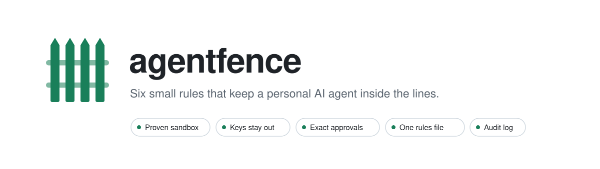

<p align="center">
  <picture>
    <source media="(prefers-color-scheme: dark)" srcset="docs/assets/banner-dark.svg">
    
  </picture>
</p>

<p align="center">
  <a href="https://github.com/vn-envy/agentfence/actions/workflows/ci.yml"></a>
  
  
  
  <a href="LICENSE"></a>
</p>

<p align="center">
  <a href="#quick-start">Quick start</a> ·
  <a href="#use-it-in-your-harness">Use it</a> ·
  <a href="docs/ARCHITECTURE.md">Architecture</a> ·
  <a href="CHANGELOG.md">Changelog</a> ·
  <a href="SECURITY.md">Security</a>
</p>

---

Your agent writes code and calls tools on your machine, with your keys. **agentfence** puts that code in a box the operating system enforces: no network, one writable folder, no keys, and a startup check that proves all of it before anything runs. Everything around the box follows the same thinking. Keys go only to the hosts you name, outward actions wait for your yes, the rules live in one file you review, and every step is logged.

One Python package. No dependencies, no daemon, no VM. Seatbelt on macOS, bubblewrap on Linux.

> [!NOTE]
> Beta (v0.1). Inspired by [NVIDIA OpenShell](https://github.com/NVIDIA/OpenShell), which fences fleets of agents; agentfence is the home-sized version for one person's agent on a laptop. Not affiliated with NVIDIA.

## The six rules

| | Rule | In agentfence |
| :-: | --- | --- |
| **1** | Run what the model writes in a box with no network and one writable folder | `Box`: Seatbelt on macOS, bubblewrap on Linux |
| **2** | Keep keys out of the box | A scrubbed environment for the box; `key_for` hands a key only to the hosts it belongs to |
| **3** | Prove the box before you trust it | `agentfence check`: seven leak tests, and nothing runs if one passes |
| **4** | Ask before anything outward or irreversible, and approve the exact thing once | `Approvals.gate`: bound to a hash of the action and its arguments, used once, expires |
| **5** | Keep the rules in one file the agent can't edit, and review every change | `agentfence.toml`, `agentfence diff`, and a stop when the file changes mid-run |
| **6** | Log what happened in one append-only file | `AuditLog`: hash-chained JSON lines, readable by you only |

<p align="center">
  <picture>
    <source media="(prefers-color-scheme: dark)" srcset="docs/assets/architecture-dark.svg">
    
  </picture>
</p>

## Quick start

Requires Python 3.11 or newer.

```sh
pip install git+https://github.com/vn-envy/agentfence
```

On Linux, also install bubblewrap: `sudo apt install bubblewrap` or `sudo dnf install bubblewrap`. On macOS there is nothing else to install.

```sh
agentfence init                        # writes agentfence.toml
agentfence check                       # proves the box on this machine
agentfence run -- python3 script.py    # runs a command in the box
```

`agentfence check` runs a small script inside the box that tries to leak, and shows what it could and couldn't do:

```console
$ agentfence check
agentfence check · backend seatbelt
  ok    write_own_folder                         allowed
  ok    read_secret                              denied
  ok    read_through_symlink                     denied
  ok    hard_link_secret                         denied
  ok    list_home                                denied
  ok    network                                  denied
  ok    write_outside                            denied
  ok    must_not_read:/Users/you/.ssh            denied
seatbelt: no home folder, no secrets, no network; writes only /Users/you/project/agent-work.
```

## Use it in your harness

```python
from agentfence import Fence

fence = Fence.from_file("agentfence.toml")
fence.prove()                                     # 3: raises FenceNotProven if the box leaks

result = fence.run_python(code_the_model_wrote)   # 1 and 2: no network, no keys, one folder
print(result.stdout, result.removed_links)

email = {"to": "friend@example.com", "subject": "Lunch", "body": "Thursday at 1?"}
if fence.gate("send_email", target=email["to"], args=email):   # 4: asks you first
    send(email)

fence.check_url(url)                              # the harness's own calls: named hosts only
headers = {"x-api-key": fence.key_for("ANTHROPIC_API_KEY", url)}
```

Every call refuses with `RulesChanged` if `agentfence.toml` changes after it was loaded (rule 5), and lands in `.agentfence/audit.jsonl` (rule 6).

In a terminal, `gate` asks right there. Anywhere else, pass your own `ask=` function, such as a phone notification or a chat button. To approve from another process, use `propose`, `decide` and `consume` instead. [`examples/harness.py`](examples/harness.py) walks through every rule.

## The rules file

```toml
[box]
workdir = "./agent-work"                 # the one folder the box may write
also_write = []
also_read = []
must_not_read = ["~/.ssh", "./.env"]     # the startup check proves these unreadable
timeout_seconds = 60

[net]
allow = ["api.anthropic.com"]            # hosts the harness may call; ".example.com" allows subdomains

[keys]
ANTHROPIC_API_KEY = ["api.anthropic.com"]   # each key goes only here, never into the box

[approve]
verbs = ["send", "pay", "delete", "remove", "post", "publish", "submit", "buy", "purchase", "book", "transfer"]
ttl_minutes = 15
```

Loading refuses rules that would undo themselves:

- the rules file inside a folder the box may write;
- a `must_not_read` path the box is allowed to read;
- a key sent to a host `[net]` doesn't list;
- unknown sections or keys, so a typo can't quietly change anything.

<details>
<summary><b>Reviewing a change:</b> <code>agentfence diff</code> names everything a change widens</summary>

<br>

Ask one question of every change: does it add a host, a folder or a write verb?

```sh
git show HEAD:agentfence.toml > /tmp/old.toml
agentfence diff /tmp/old.toml agentfence.toml --base .
```

It exits 1 and names each widening, so it fits in CI or a pre-commit hook.

| Finding | Meaning |
| --- | --- |
| `write_added` | The box may write a new folder |
| `read_added` | The box may read a new folder |
| `check_removed` | The startup check no longer proves a path unreadable |
| `host_added` | The harness may call a new host |
| `credentialed_host_added` | A new host that also receives a key |
| `key_added` | A new key |
| `key_reach_expanded` | An existing key goes to more hosts |
| `approval_removed` | Actions with that verb no longer ask |
| `approval_window_longer` | Approvals stay valid longer |

</details>

<details>
<summary><b>What the box allows</b>, per platform</summary>

<br>

| | macOS (Seatbelt) | Linux (bubblewrap) |
| --- | --- | --- |
| **Read** | System folders, the Python interpreter and its packages, the box's folders | `/usr`, a short list of `/etc` files, the interpreter, the box's folders |
| **Write** | The box's folders | The box's folders |
| **Network** | None, including 127.0.0.1 | None: a new network namespace |
| **Home** | `HOME` and `TMPDIR` point inside the box | Same; the real home is not mounted |

The harness side matters as much as the box:

- Output comes back through pipes the harness opened, never through a file the code could swap for a link.
- When a run ends, its whole process group is killed.
- Any symbolic or hard link the code left in a writable folder is removed before anything reads it.

[docs/ARCHITECTURE.md](docs/ARCHITECTURE.md) explains every rule in both profiles.

</details>

## What it does not do

- **Not a kernel exploit defence.** It is no protection against a hostile local user either. It fences code a model wrote, and gives your harness a checklist.
- **The harness is trusted.** If you later open a path the model handed you, check it yourself.
- **Network tools don't run in the box.** The harness makes those calls, through `check_url`.
- **Approvals live in memory** in v0.1. If several processes share them, persist the proposals yourself.
- **The log's hash chain has a blind spot.** It shows edits and deletions in the middle, not lines cut off the end.
- **Windows is not supported.**
- **`sandbox-exec` is marked deprecated** in Apple's man page, but it still ships with macOS. The startup check is what tells you it still holds on your machine.

## Documentation

- [Architecture](docs/ARCHITECTURE.md): the trust boundary, every module, the life of a run, and the threat model
- [Changelog](CHANGELOG.md) and [release notes](docs/releases/v0.1.0.md)
- [Security policy](SECURITY.md): how to report a way around the box

## Credits and license

The ideas come from NVIDIA OpenShell's architecture and security docs: a supervisor apart from the sandbox, deny-by-default egress, credentials only at approved endpoints, a policy prover, and a fail-closed launch. Any mistakes in the small version are ours.

Apache License 2.0. See [LICENSE](LICENSE).
