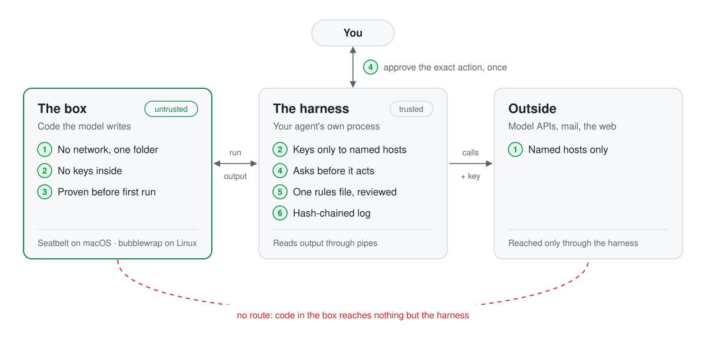
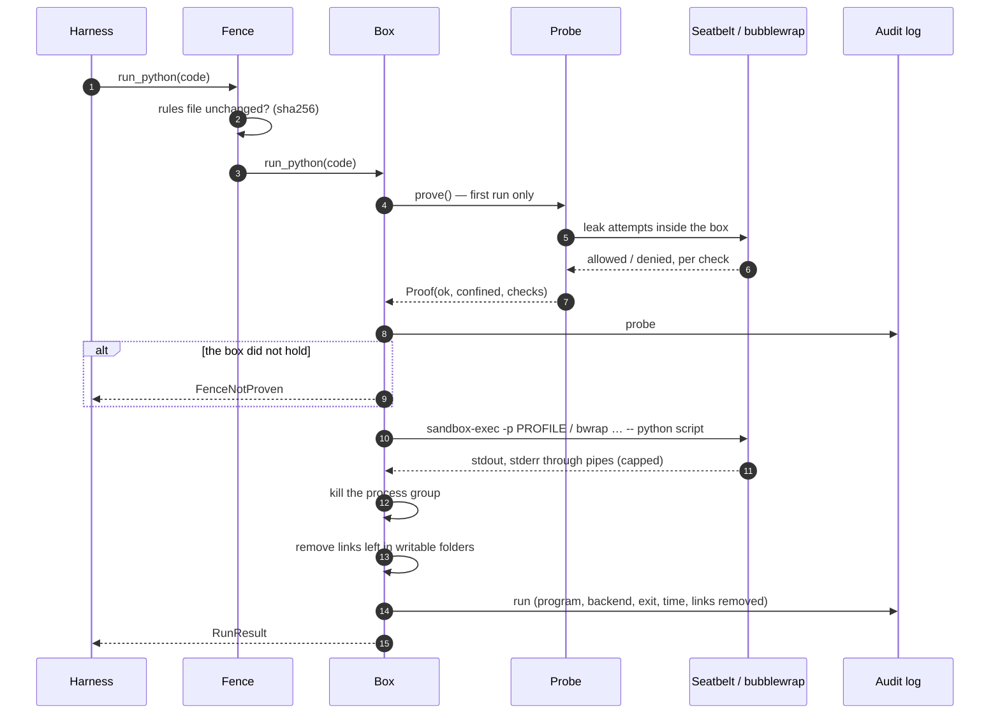
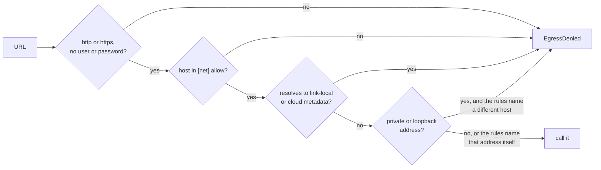
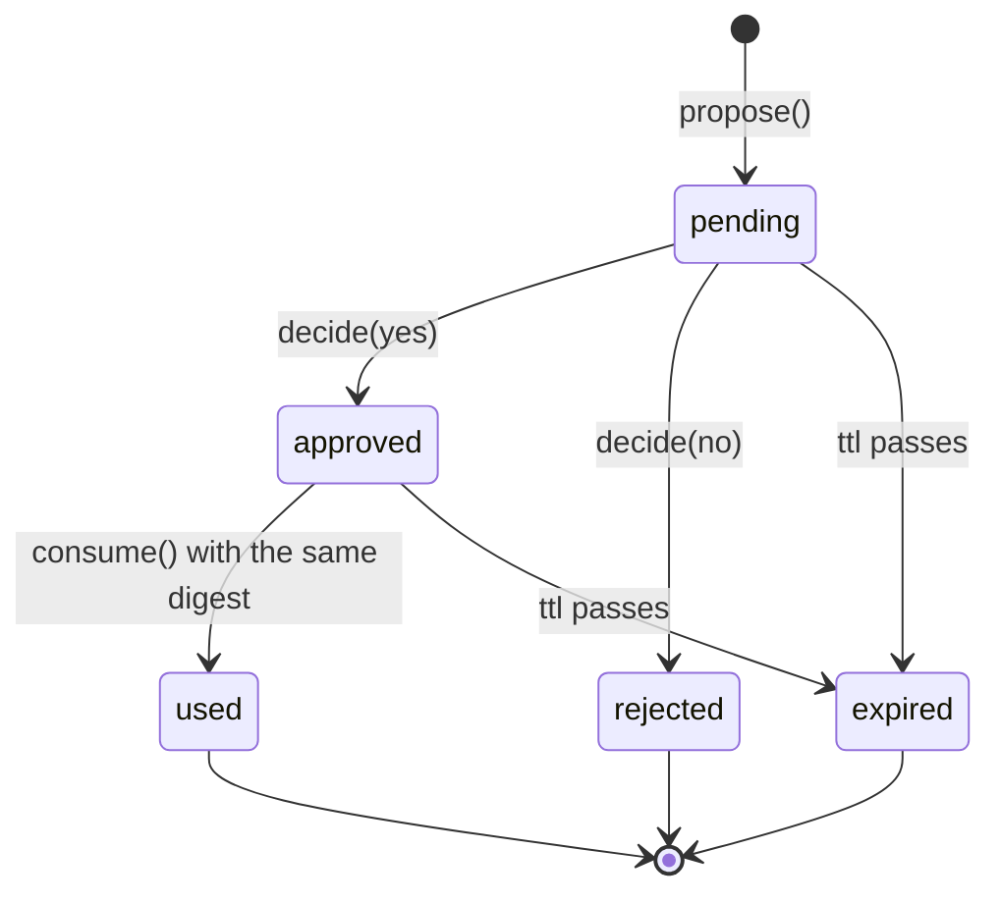

# Architecture

agentfence splits a personal agent into two parts. There is a **box** where model-written code runs and can reach almost nothing, and a **harness** (your agent's own process) that holds everything valuable and decides what happens. This document covers:

- where that line runs;
- what each module does to hold it;
- the life of one run;
- the threat model, and what stays out of scope.

<p align="center">
  <picture>
    <source media="(prefers-color-scheme: dark)" srcset="assets/architecture-dark.svg">
    
  </picture>
</p>

## Contents

1. [Goals](#goals)
2. [The trust boundary](#the-trust-boundary)
3. [Modules](#modules)
4. [The life of a run](#the-life-of-a-run)
5. [The box](#the-box)
6. [The startup check](#the-startup-check)
7. [Keys and outbound calls](#keys-and-outbound-calls)
8. [Approvals](#approvals)
9. [The rules file](#the-rules-file)
10. [The audit log](#the-audit-log)
11. [Threat model](#threat-model)
12. [How it relates to OpenShell](#how-it-relates-to-openshell)
13. [Design decisions](#design-decisions)

## Goals

- **Contain model-written code.** No network, one writable folder, no view of the home folder, the repository or other people's data.
- **Keep secrets in the harness.** A key leaves only in a request to a host the rules name for it.
- **Put people in front of consequences.** Sending, paying, deleting and posting wait for a yes to that exact action.
- **Fail closed.** If the box cannot be shown to hold on this machine, nothing runs in it.
- **Stay small enough to read.** Standard library only; about 1,500 lines, docstrings included.

**Non-goals.** agentfence doesn't defend against:

- kernel exploits;
- a hostile local user;
- a compromised harness;
- Windows.

It doesn't orchestrate fleets or remote sandboxes; OpenShell does that.

## The trust boundary

| Zone | Trusted? | Runs | Can reach |
| --- | --- | --- | --- |
| **The box** | No | Code the model wrote, and tools that touch files | Its own folder; system files and the interpreter (read-only); nothing else |
| **The harness** | Yes | Your agent loop, with agentfence as a library | Everything the user can; it is the only way out of the box |
| **Outside** | No | Model APIs, mail, websites | Reached only by the harness, only at hosts the rules name |
| **You** | Yes | Approvals and the rules file | Every decision with consequences |

The harness is trusted, but it is also where the subtle bugs live. The box stops the code *reading* a secret, but a harness that later reads the box's folder can be tricked into reading it for the code. Much of `box.py` exists to keep the harness from becoming that confused deputy (see [The box](#the-box)).

## Modules

| Module | Rule | Responsibility |
| --- | :-: | --- |
| [`box.py`](../agentfence/box.py) | 1 | `Box`: backend detection, the Seatbelt profile, the bubblewrap command line, spawning, output pipes, process-group cleanup, link sweeping |
| [`env.py`](../agentfence/env.py) | 2 | The box's environment: a short allowlist, never a name that looks like a secret |
| [`probe.py`](../agentfence/probe.py) | 3 | The startup check: seven leak attempts inside the box, judged from both sides |
| [`approvals.py`](../agentfence/approvals.py) | 4 | Commit-verb detection, proposals bound to a digest, single use, expiry |
| [`policy.py`](../agentfence/policy.py) | 5 | Loading and validating `agentfence.toml`; `widening()` for reviewing changes |
| [`net.py`](../agentfence/net.py) | 1, 2 | `check_url` for the harness's own calls; `key_for` for per-host keys |
| [`audit.py`](../agentfence/audit.py) | 6 | Hash-chained, append-only JSON lines |
| [`fence.py`](../agentfence/fence.py) | all | `Fence`: the six rules behind one object; stops when the rules file changes |
| [`cli.py`](../agentfence/cli.py) | | `init`, `check`, `run`, `diff`, `verify-log` |
| [`errors.py`](../agentfence/errors.py) | | One exception type per kind of refusal |

## The life of a run

`fence.run_python(code)`, start to finish:



The steps that keep the harness safe happen after the code exits: killing the group, removing links, and reading output from pipes. Leftover processes could keep writing into the folder, and a leftover link could make the harness read a secret on the code's behalf.

## The box

### Backends

| Backend | When | How |
| --- | --- | --- |
| `seatbelt` | macOS | `sandbox-exec -p PROFILE` with a deny-by-default profile built per run |
| `bubblewrap` | Linux with `bwrap` installed | New namespaces for everything (so no network); a minimal read-only filesystem |
| `none` | Only when you choose it | No box. The startup check reports it as not confined |

`auto` (the default) picks the first available. With neither available, the check fails and nothing runs, so you never get "no box" by accident.

### The Seatbelt profile

Every line is an allowance on top of `(deny default)`:

| Rule | Why |
| --- | --- |
| `(allow process-fork)` `(allow process-exec)` | The interpreter and the tools it starts (such as ffmpeg). Each inherits the profile. |
| `(allow signal (target same-sandbox))` `(allow process-info* (target same-sandbox))` | Processes in the box may manage each other, and nothing outside |
| `(allow sysctl-read)` | CPU count, page size and the like |
| `(allow file-read-metadata)` | Names and sizes along a path, so `stat` and `realpath` work. Never file contents or folder listings. |
| `(allow file-read* (literal "/"))` | The root folder itself, and only its top-level names. The loader reads it as every process starts. |
| `(allow file-read* file-map-executable …system and interpreter folders…)` | Read these folders, and load libraries from them. Never code from the box's own folder. |
| `(allow file-read* file-write* …the box's folders…)` | The one place the code may write |
| `(allow file-write-data …/dev/null, /dev/zero, /dev/dtracehelper…)` `(allow file-ioctl (literal "/dev/dtracehelper"))` | What every process touches at start |
| `(allow mach-lookup …)` | User and group lookups and logging, nothing more |
| *(no network rule)* | Every socket is denied, 127.0.0.1 included |

The root-folder rule came from running the box on real macOS machines in CI, not from documentation. Without it, even `/usr/bin/true` aborts, because the loader reads `/` as every process starts. The dtrace rule only quiets a harmless denial every process makes. CI prints the kernel's Sandbox deny log whenever a macOS job fails, so the next surprise names its rule.

### The bubblewrap command line

```text
bwrap --unshare-all --die-with-parent --new-session --cap-drop ALL
      --ro-bind /usr /usr   --symlink usr/bin /bin   (and /lib, /lib64, …)
      --ro-bind <a short list of /etc files>        (not /etc: as root, the box could read /etc/shadow)
      --proc /proc  --dev /dev  --tmpfs /tmp
      --ro-bind <interpreter and read roots>
      --bind <the box's folders>
      --chdir <workdir> -- <command>
```

`--unshare-all` includes a new network namespace, so the box has no interfaces but a loopback of its own. The real home folder is never mounted.

### Around every run

- **Environment.** `HOME` and `TMPDIR` point inside the box, and libraries keep their caches there too. Only a short allowlist of variables passes through, and never a name containing `KEY`, `TOKEN`, `SECRET`, `PASSWORD`, `PASSWD`, `CREDENTIAL`, `AUTH`, `COOKIE` or `SESSION`, even if someone lists it.
- **Output.** Output goes through pipes, not temp files. Two reader threads keep the first 64 KB of each stream and drain the rest, so a flood of output can't fill memory or block the child. A pipe has no path, so the code can't swap it for a link.
- **Cleanup.** The whole process group is killed when the run ends or times out, so nothing keeps running or writing after the harness looks.
- **Link sweep.** Symbolic links, and files with more than one hard link, are removed from every writable folder before a result is returned.

## The startup check

`Box.prove()` runs once per box, before its first run. `agentfence check` runs the same check on demand. A small script inside the box attempts:

| Check | Must be | What it tries |
| --- | --- | --- |
| `write_own_folder` | allowed | Write a file in the box's folder |
| `read_secret` | denied | Read a file only the harness can see |
| `read_through_symlink` | denied | Read that file through a symlink made inside the box |
| `hard_link_secret` | denied | Hard-link that file into the box |
| `list_home` | denied | List the real home folder |
| `network` | denied | Connect to a listener the harness opened on 127.0.0.1 |
| `write_outside` | denied | Write a file next to the box's folder |
| `must_not_read:<path>` | denied | Read each path in the rules' `must_not_read` |

How each result is judged:

- **What counts as denied.** "Not permitted", "not found", "refused" and "unreachable" all mean the box held. On Linux a hidden path simply doesn't exist inside the box. Any other error is *unclear*, and unclear fails the check.
- **Writes are judged by the harness.** A write outside counts only if the file appears on the real disk. bubblewrap's private `/tmp` can accept a write that never reaches the host.
- **Mount points aren't a leak.** bubblewrap shows empty folders where the box's own folders are mounted. A home listing is a leak only if it shows a real name.
- **Leftovers are removed.** Everything the check creates is deleted afterwards, inside and outside the box.

The check is itself tested. `test_the_check_catches_an_unboxed_run` takes the box away and asserts that every leak is reported.

## Keys and outbound calls

The box has no network. When a tool needs the internet, the harness makes the call, and asks first:



`key_for(name, url)` returns a key only when all of these hold:

- the key is listed in `[keys]`;
- the URL passes `check_url`;
- the host is one the rules send that key to;
- the scheme is https (plain http only to loopback).

The key's value comes from the harness's environment and never enters the box.

## Approvals

An action needs a yes when its name carries a commit verb. Names are split on camelCase and punctuation, so `send_email`, `submitForm`, `Post update` and `payment` all match. A yes is bound to a SHA-256 digest of the action, its target and its arguments, so changing one word of an email makes it a new request.



`gate()` does all of this in one call through an `ask` function. With no `ask`, the proposal stays pending, and another process (a phone, a chat button) calls `decide`; the harness then calls `consume`. The log records the digest, never the arguments, so it doesn't become a copy of every message.

## The rules file

`Policy.load` refuses rules that would undo themselves:

| Refused | Because |
| --- | --- |
| The rules file inside a folder the box may write | The box could rewrite its own rules |
| A `must_not_read` path inside `workdir`, `also_write` or `also_read` | The check would prove something false |
| A key sent to a host `[net]` doesn't allow | The key could never be used legitimately |
| Unknown sections or keys | A typo must not quietly change anything |
| An empty or wrongly typed value | The same |

`Fence` hashes the file when it loads and checks the hash before every call, so a changed rules file stops the harness. It never picks up the change silently.

`widening(old, new)` compares two rule sets and names everything the new one allows that the old one didn't: hosts, folders, key reach, weaker approvals. It's the home-sized version of OpenShell's policy prover: set differences, no solver. `agentfence diff` prints the findings and exits 1, which suits CI and pre-commit hooks.

## The audit log

One JSON object per line, written with `O_APPEND` to a file created with mode `0600`. Each line carries `prev`, the SHA-256 of the line before it, so `AuditLog.verify` finds an edited or deleted line anywhere in the middle. Lines cut off the end can't be detected this way; keep a copy elsewhere if that matters. The log may not live inside a folder the box can write.

| Event | Written when |
| --- | --- |
| `probe` | The startup check runs, with every check's result |
| `run` | A run ends: program name, backend, exit code, time, links removed |
| `approval_requested` / `_approved` / `_rejected` / `_used` | An approval moves, with its digest |
| `action` | A non-commit action passes the gate |
| `egress` / `egress_denied` | `check_url` allows or refuses a call |
| `key_released` / `key_denied` | `key_for` hands out or refuses a key |
| `rules_changed` | The rules file changed under a running harness |

## Threat model

| Threat | Defence | What remains |
| --- | --- | --- |
| Model code reads private files by building paths at run time | OS box: reads limited to system files, the interpreter and the box | Anything you add to `also_read`, or put inside the interpreter's folders |
| Data sent out over the network | No network in the box; harness calls only to named hosts | Every host you name is a possible exfiltration path |
| Key theft | Keys never enter the box; `key_for` per host, over https | A compromised harness process |
| The box tricks the harness into reading a secret | Pipes for output, link sweep, harness-side write check | Harness code that later opens a path the model handed it |
| Runaway or lingering processes | Timeout, process-group kill; a PID namespace on Linux | On macOS, a process that leaves its group with `setsid` keeps running (still inside the box) |
| The agent edits its own rules | Rules file outside the box; hash check before every call; `diff` for review | You approving a widening without reading it |
| A consequential action without consent | Commit-verb approvals bound to a digest, used once, expiring | A tool whose name has no commit verb: name tools plainly, or add verbs |
| An OS update quietly weakens the box | The startup check before the first run; fail closed | Anything the check doesn't test |
| Someone edits the log | Hash chain, `verify-log` | Lines cut off the end; someone rewriting the whole chain |

## How it relates to OpenShell

| OpenShell | agentfence |
| --- | --- |
| A trusted supervisor outside the sandbox makes every decision | The harness process; the box only runs code |
| Landlock, seccomp and a network namespace; egress through a policy proxy | Seatbelt or bubblewrap; the box has no network at all |
| Credentials added only to requests bound for approved endpoints | `key_for`: per key, per host, https only |
| A formal prover flags risky policy changes before approval | `widening()`: set differences over hosts, folders, keys and approval verbs |
| `link_local_reach` | Link-local and metadata addresses are always refused by `check_url`, whatever the rules say |
| `credential_reach_expansion` | `key_added`, `key_reach_expanded`, `credentialed_host_added` |
| `capability_expansion` (a new HTTP method with a credential) | No per-method rules yet; commit verbs go through approvals instead |
| `l7_bypass_credentialed` | Not applicable: nothing leaves the box, and the harness makes only the calls it chooses |
| The boundary is confirmed before the agent starts | The startup check; fail closed |
| Audit mode, then enforce | Enforce only |
| Gateways, fleets, Kubernetes, microVMs, telemetry | Out of scope; nothing is sent anywhere |

## Design decisions

- **Standard library only.** A security tool you can read in an afternoon, with nothing to audit upstream.
- **Allowlists, not rule ordering.** Every profile starts from deny, so its meaning doesn't depend on how the OS orders overlapping rules.
- **Proven, not assumed.** A profile that looks right can still fail on a given OS version. The check runs on the machine that will run the code.
- **Fail closed.** Unclear results, missing backends and a changed rules file all stop the harness, with a reason. Running without a box takes an explicit `backend="none"`.
- **Pipes, not spool files.** A pipe has no name the code could swap for a link. It also doesn't rely on the sandbox letting the box write to a file outside it through an inherited descriptor.
- **Test the real thing.** CI runs the real sandboxes on macOS and Linux runners, on Python 3.11 and 3.13, and the example harness end to end.
